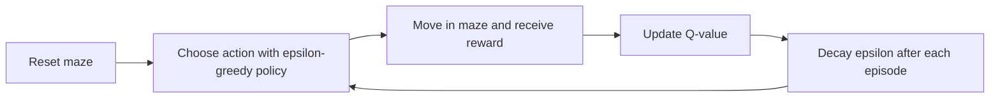

# Q-Learning Maze Solver

A compact reinforcement learning project where a Q-learning agent learns to navigate a maze, balance exploration with exploitation, and expose its policy through a simple Pygame visualizer.

## Highlights
- Grid-based maze environment with rewards and penalties
- Tabular Q-learning agent with epsilon-greedy exploration
- Command-line training flow for fast experiments
- Pygame visualizer for training, solving, and policy inspection
- Example scripts and unit tests for the environment and agent

## Learning Loop


## Project Layout
```text
Q-learning-maze-solver/
|-- src/
|   |-- maze.py
|   |-- qlearning.py
|   `-- gui.py
|-- examples/
|   |-- example_usage.py
|   `-- run_gui.py
|-- tests/
|   |-- test_maze.py
|   `-- test_qlearning.py
|-- requirements.txt
|-- .gitignore
|-- LICENSE
`-- README.md
```

## Quickstart
1. Create a virtual environment if you want an isolated setup.
2. Install the core dependency:
   ```sh
   python -m pip install -r requirements.txt
   ```
3. Optional GUI support:
   ```sh
   python -m pip install pygame
   ```

## Run The Project
Train from the command line:
```sh
python src/qlearning.py
```

Launch the GUI visualizer:
```sh
python examples/run_gui.py
```

Run the tests:
```sh
python -m unittest discover -s tests
```

## Reward Design
- Reach goal: `+100`
- Hit wall or boundary: `-10`
- Take a normal step: `-1`

## GUI Controls
- `T`: train in real time
- `S`: solve with the learned policy
- `W`: inspect the current policy
- `R`: reset the session
- `Q`: quit

## Extension Ideas
- Support larger custom mazes
- Add policy heatmaps or reward charts
- Compare Q-learning hyperparameters side by side
